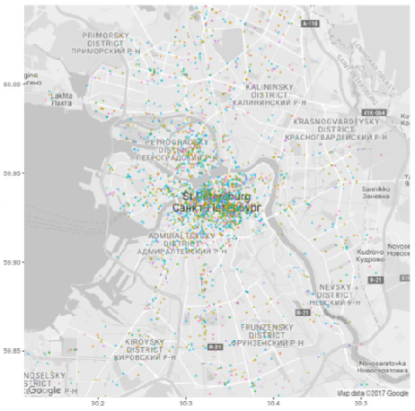

```{r setup, include=FALSE}
knitr::opts_chunk$set(echo = FALSE)
```

## Описание идеи


## Распределение ролей

- Алина: сбор данных из со страници группы KudaGo ВКонтакте; данных о пользователях, лайкавших посты 
- Аня: разработка рекамендательной системы, бэкэнд в Shiny
- Ксюша: анализ текстов, выделение топиков; работа с картой
- Оля: предобработка данных, описательная статистика, презентация
- Стас: разработка интерфейса, фронтэнд в Shiny

<div class="centered">


</div>


## Описание данных

<div class="columns-2">


  
Посты из группы KudaGo ВКонтакте: для получения лайкнувших пользователей и мэтчинга их с постами с сайта KudaGo по url-ссылкам.

</div>

## Описание данных

```{r, include=F}
library(ggplot2)
library(dplyr)
library(tidyr)
data = read.csv("~//spbRecommend/users_get.csv", sep=",")
d=select(data, bdate)
user_year=data %>% separate(bdate, c("Date", "Month", "Year"))
user_year=cbind(user_year, d)
user_year=filter(user_year, Year > 0)
user_year= mutate(user_year, age= as.numeric(2017-as.numeric(Year)))

not_empty = filter(user_year, age < 50)
not_empty = filter(not_empty, occupationType != "NA")
not_empty=mutate(not_empty, Gender=ifelse(sex==1, "female", "male"))
not_empty$Gender = as.factor(not_empty$Gender)
f= dplyr::group_by(not_empty, sex, occupationType) %>%
  summarise(count=n())
f=mutate(f, Gender=ifelse(sex==1, "female", "male"))
```


<div class="columns-2">

```{r f, echo=F, fig.width = 4, fig.height = 5}
ggplot(data=f, aes(x=Gender, y=count, fill = occupationType)) +
    geom_bar(stat="identity") + ggtitle("Чем занимаются")
```
  
Личная информация о пользователях, лайкавших посты в группе KudaGo ВКонтакте: 

  - имя
  - возраст
  - пол 
  - город
  - сайт
  - телефон
  - и др.

</div>

## Описание данных

occup type ~ age

<div class="columns-2">

```{r p, echo=F, warning=F, fig.width = 4, fig.height = 5}
p <- ggplot(not_empty, aes(Gender, age))
p + geom_boxplot()+ 
  ggtitle("Возраст")
```
  
Личная информация о пользователях, лайкавших посты в группе KudaGo ВКонтакте: 

  - имя
  - возраст
  - пол 
  - город
  - сайт
  - телефон
  - и др.

</div>

## Описание данных

<div class="columns-2">


События/мероприятия с сайта KudaGo:
 
  - название
  - описание
  - даты проведения
  - возрастные ограничения
  - теги и категории, присвоенные сайтом
  - цена 
  - и др.
</div>


## Описание данных

<div class="columns-2">
  

Места с сайта KudaGo:

  - название
  - описание
  - часы работы
  - широта и долгота
  - теги и категории, присвоенные сайтом
  - ближайшая ст. метро 
  - сайт 
  - и др.
</div>


## Интерфейс

Here is text

## Same text in center

<div class="centered">
Here is text
</div>

<div class="red2">
Red text
</div>

<div class="centered">
<div class="red2">
Red text in center
</div>
</div>

## Slide with R Output

```{r cars, echo = TRUE}
summary(cars)
```

## Slide with Plot

```{r pressure}
plot(pressure)
```

