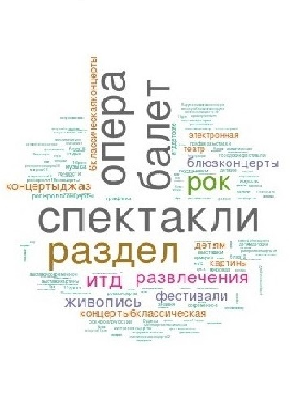
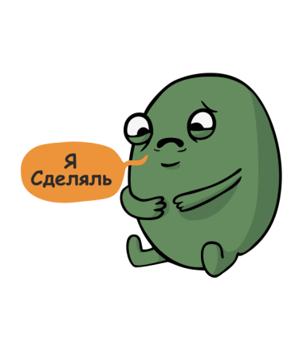

```{r setup, include=FALSE}
knitr::opts_chunk$set(echo = FALSE)
```

## Описание идеи

Рекомендовать события в Санкт-Петербурге с портала KudaGo

1. Пользователь авторизуется ВКонтакте
2. Machine Learning
2. Выводится рекомендация событий в Питере
3. Profit

<div class="centered">

</div>
  
## Распределение ролей

- <b>Алина</b>: работа с API VK 
- <b>Аня</b>: ML, работа с API KudaGo
- <b>Ксюша</b>: анализ текстов, выделение топиков; работа с картой
- <b>Оля</b>: предобработка данных, описательная статистика, презентация
- <b>Стас</b>: UI

<div class="centered">


</div>

## Описание данных

```{r, include=F}
library(ggplot2)
library(dplyr)
library(tidyr)
data = read.csv("~//spbRecommend/vk/users_get.csv", sep=",")
d=select(data, bdate)
user_year=data %>% separate(bdate, c("Date", "Month", "Year"))
user_year=cbind(user_year, d)
user_year=filter(user_year, Year > 0)
user_year= mutate(user_year, age= as.numeric(2017-as.numeric(Year)))

not_empty = filter(user_year, age < 50)
not_empty = filter(not_empty, occupationType != "NA")
not_empty=mutate(not_empty, Gender=ifelse(sex==1, "female", "male"))
not_empty$Gender = as.factor(not_empty$Gender)
f= dplyr::group_by(not_empty, sex, occupationType) %>%
  summarise(count=n())
f=mutate(f, Gender=ifelse(sex==1, "female", "male"))
```


<div class="columns-2">

```{r f, echo=F, fig.width = 4, fig.height = 5}
ggplot(data=f, aes(x=Gender, y=count, fill = occupationType)) +
    geom_bar(stat="identity") + ggtitle("Чем занимаются по полу")
```
  
Личная информация о пользователях, лайкавших посты в группе KudaGo ВКонтакте: 

  - имя
  - возраст
  - пол 
  - город
  - сайт
  - телефон
  - и др.

</div>

## Описание данных

<div class="columns-2">



События/мероприятия с сайта KudaGo:
 
  - название
  - описание
  - даты проведения
  - возрастные ограничения
  - теги и категории, присвоенные сайтом
  - цена 
  - и др.
</div>


## Описание данных

<div class="columns-2">
  

Места с сайта KudaGo:

  - название
  - описание
  - часы работы
  - широта и долгота
  - теги и категории, присвоенные сайтом
  - ближайшая ст. метро 
  - сайт 
  - и др.
</div>

## Рекомендательная система

Кластеризация пользователей на основе интересов

- интересы --- активность в паблике KudaGo
- иерархическая клаcтеризация матрицы расстояний


Предсказание кластера для нового пользователя

- использование данных с аккаунта пользователя в VK
- применение KNN


## Интерфейс

[ссылка](https://aabakhitova.shinyapps.io/shiny/)

<div class="centered">

</div>
